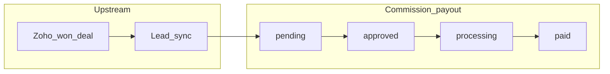

# Finance: commissions, invoicing, and payout workflow

Operator guide for the **admin** app: how partner commissions are calculated, how payouts are tracked, and how invoices relate. This document reflects **current product behavior** in code, including limitations.

---

## Roles and access

These areas are restricted to internal team members with one of:

- `super_admin`
- `admin`
- `finance`

**Commissions:** Approve, reject, start payout, and mark paid on `/commissions` require the roles above (`apps/admin/src/app/(dashboard)/commissions/page.tsx` uses the same RBAC check as the commission API routes).

**Invoices:** Creating invoices (`POST /api/admin/invoices`) requires the same finance/admin roles (`apps/admin/src/app/api/admin/invoices/route.ts`).

Partners authenticate in the **partner** app; they see their **commissions ledger** there. They do **not** have invoice views in this codebase today.

---

## Commissions versus invoices

| Aspect | Commissions | Invoices |
|--------|-------------|----------|
| **Meaning** | Amount **owed to the partner**, derived from a won deal’s basis (service fee / AR) and the partner’s commission model | Manual billing record tied to a **partner** (and optionally a **service request**): period, subtotal, discount, tax, due date |
| **Creation** | Automatic when a **lead** syncs from Zoho CRM and commission is calculated | Manual entry in admin: **`/invoices/new`** → `POST /api/admin/invoices` |
| **Partner visibility** | Partner app commissions page | Not exposed to partners in the partner app |

**Takeaway:** Commissions track **partner payables** tied to conversions. Invoices track **documents you manually define** against a partner (e.g. fees or adjustments your policy assigns to invoicing—they are **not** auto-linked to commission rows).

---

## Commission lifecycle

### Prerequisites (before a pending commission appears)

1. **Lead path + Zoho deal:** Commission rows for leads are created when syncing the lead with CRM so a won deal exists and **`ensureLeadCommissionFromDeal`** runs (`apps/admin/src/app/api/leads/[id]/sync/route.ts`).
2. **Deal amounts in Zoho:** The sync uses **AR Amount** when present; otherwise **Deal Amount**. If both are missing or zero, sync fails with guidance to set AR Amount on the closed-won deal.
3. **Partner commission configuration:** Either a **`commission_model`** linked via `commissionModelId` on the partner, or legacy **`commissionRate`** plus valid **`commissionType`** (`flat` / `percentage`) resolved by `resolvePartnerCommissionModel` in the same sync route.

The engine **`calculateCommission`** (`packages/commission-engine/src/index.ts`) applies **flat %** or **tiered** rules from that model (milestone bonuses are documented in code as handled separately—not per-transaction in that calculator).

### Status flow and admin actions

| Status | Meaning | Typical finance action |
|--------|---------|-------------------------|
| `pending` | Calculated row awaiting review | **Approve** or **Reject** |
| `approved` | Cleared for payout queue | **Start Payout** when ready operationally |
| `processing` | Payout tracked in-flight in the system | Execute bank transfer externally, then **Mark as Paid** |
| `paid` | Settled in the ledger | No further transitions in normal flow |
| `disputed` | Rejected (shown as “Rejected” in UI) | — |

**APIs (browser forms post to these routes):**

- Approve → `POST /api/commissions/[id]/approve`
- Reject → `POST /api/commissions/[id]/reject`
- Start Payout → `POST /api/commissions/[id]/process`
- Mark as Paid → `POST /api/commissions/[id]/paid`

**Emails:** approving triggers a commission-approved email; marking paid triggers a commission-paid email (`packages/notifications`).

**Audit:** Each row links to **source type** (`lead` or `service_request`) and **source id**. Use **View** (eye icon) from the commissions table to open the lead or service request detail.

### Diagram (high level)

---

## Operational payout (what finance does outside the portal)

**“Start Payout”** transitions the commission to `processing` and inserts a **`payout_requests`** row linked to that commission (`packages/db/src/schema/commissions.ts`). It records that your team has begun the payout in your operational sense.

The application **does not**:

- initiate bank wires or ACH;
- call **Stripe** to move funds; or
- post to your ERP/GL automatically.

Fields **`stripe_transfer_id`** on commissions and **`stripe_payout_id`** on payout requests exist for future integrations but **are not populated by current payout routes**.

**Recommended operating procedure:**

1. On **Approve**, optionally align with commercial/legal sign-off internally.
2. On **Start Payout**, initiate the partner payment through your treasury process (same amount/currency shown on the row).
3. After the payment confirms in banking, click **Mark as Paid** so the partner portal and notifications stay aligned with reality.

Keep bank references and ERP journal IDs in your finance system-of-record unless/until product adds explicit metadata fields.

---

## Invoices (admin)

### How to create

1. Sign in as **finance** (or admin / super_admin).
2. Navigate to **`/invoices`** → **New Invoice** (`/invoices/new`).
3. Fill **partner**, optional **service request** (selecting an SR prefills partner), **billing period**, **subtotal**, **discount**, **tax**, **currency**, **payment terms**, **due date**, and initial **status** (`draft` or `sent`).
4. Submit → the API creates **`INV-#####`** style numbers sequentially per tenant (non-deleted invoice count).

### After creation

The **invoice detail** page (`/invoices/[id]`) is **read-only**: it displays totals, period, notes, and links to partner/service request.

There is **no** surfaced UI today to:

- change status after create (draft → sent → paid, void, overdue);
- generate or download PDF; or
- sync to Stripe Billing (optional `stripe_invoice_id` exists on schema but creation flow does not set it).

**Overdue:** The schema supports `overdue`; there is **no** automated job observed that flips statuses when past due—treat statuses as authoritative only when maintained through creation-time choice or external processes.

Partners **cannot** view these invoices in the partner dashboard in the current codebase.

---

## Gap summary (stakeholder expectations)

| Area | Today | Possible future work |
|------|--------|---------------------|
| Payout rails | Manual bank + **Mark as Paid** | Populate Stripe Connect or treasury APIs; persist external refs in UI |
| Invoice lifecycle | Create + view | PATCH/status actions, overdue automation, PDF, partner-visible copies |
| Commissions ←→ invoices | No automatic link | Design if invoicing partners for fees must tie to commissions |

---

## File references (for engineers)

| Topic | Location |
|--------|-----------|
| Commission schema & payout_requests | `packages/db/src/schema/commissions.ts` |
| Lead sync + commission creation | `apps/admin/src/app/api/leads/[id]/sync/route.ts` |
| Commission admin UI | `apps/admin/src/app/(dashboard)/commissions/page.tsx` |
| Invoice API (POST only) | `apps/admin/src/app/api/admin/invoices/route.ts` |
| Invoice UI | `apps/admin/src/app/(dashboard)/invoices/` |
| Commission calculation | `packages/commission-engine/src/index.ts` |

---

_Last updated from codebase review—align operational SOP with your treasury and accounting policies._
