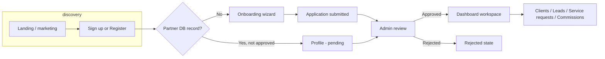

# Partner Portal — Workflows & User Journeys

**Audience:** leadership and operations management  
**Purpose:** single reference for what the product does end-to-end, how partner and internal journeys connect, and how access control shapes visibility.  
**Source:** codebase audit (Next.js apps `apps/partner`, `apps/admin`; shared packages `packages/db`, `packages/types`, RBAC/row-scope libs).  
**As of:** 2026-05-06  

---

## 1. Executive summary

The product is **two web applications** on a **shared multi-tenant data model**:

| Application | Primary users | Purpose |
|-------------|----------------|---------|
| **Partner Portal** (`apps/partner`) | Referral and channel partners | Apply to the program, sign agreements, manage **clients**, submit **leads**, request **cross-sell / service work**, track **commissions**, manage profile and settings |
| **Admin Portal** (`apps/admin`) | Internal Finanshels team | Operate **partners**, **leads** (pipeline + approval), **service delivery requests**, **invoices**, **commission** lifecycle, **analytics**, and **team user** administration |

Core revenue loop: **partner introduces opportunity → lead is qualified and progresses → deal outcome drives commission and/or invoicing**, with **Stripe** integration for billing-related automation and **email notifications** for key milestones.

---

## 2. System context

- **Authentication:** Supabase-backed sessions; public routes for sign-in, registration, password flows, and auth callbacks (`packages/auth` public route lists).
- **Tenancy:** Data is scoped by `tenant_id` (default tenant configurable via environment for partner registration).
- **Governance (admin only):** Two layers — **module permissions** (which areas a role may read/write) and **row scope** (which partners’ records appear for a given user). See §9 and `docs/admin-rbac.md`.
- **Legacy / removed:** External CRM “push/sync” for leads is **removed**; lead sync API returns **410** with guidance to use the native pipeline instead.

---

## 3. Personas & admin roles

### Partner users

- Individual associated with exactly one **partner** record (`partners.auth_user_id`).
- **Approved** partners (`status === approved`) land on the **workspace dashboard** after sign-in.
- Non-approved partners are steered to **profile** (e.g. pending review) or **onboarding** if no partner record exists yet.

### Internal team roles (canonical)

Defined in `apps/admin/src/lib/rbac.ts`: `super_admin`, `admin`, `partnership_manager`, `sales_representative`, `finance`, `viewer`. Legacy alias strings (e.g. `sdr`, `partnership`) normalize to these.

Default module access is documented in **`docs/admin-rbac.md`** (Partners, Leads, Services, Invoices, Commissions, Users, Analytics). **Users & Access** (`/settings/users`) is limited to **super_admin** and **admin**.

---

## 4. Partner user journey (end-to-end)

High-level flow:

### 4.1 Acquisition & account creation

1. **Public marketing home** (`/`) — value proposition; authenticated visitors may see tailored CTAs.
2. **Sign-in / sign-up** — Supabase auth; after login, **`/auth/continue`** resolves the correct destination:
   - No partner row → **`/onboarding`**
   - Partner not approved → **`/dashboard/profile`**
   - Approved → **`/dashboard`** (or safe `next` paths under dashboard/profile/onboarding)
3. **`/register`** (API `POST /api/register`) — structured application with company/contact data, agreement preferences, optional signature capture; creates/updates tenant partner data, stores agreement artifacts, sends **application received** email; relies on `DEFAULT_TENANT_ID` (and optional tenant bootstrap).

### 4.2 Onboarding & agreement

- **Onboarding UI** (`/onboarding`) — multi-step flow (partner type referral vs channel, details, agreement step with signature modes).
- **Profile contract flows** (`/api/profile/contract/*`) — Zoho Sign–oriented contract initiation, callbacks, agreement download (for signed partner paperwork).

### 4.3 Approved workspace (primary navigation)

From `sidebar-nav.tsx`, the main areas are:

| Area | Typical actions |
|------|-----------------|
| **Dashboard** | Overview KPIs and entry points |
| **Clients** (“client book”) | Maintain referred/attributed clients (`/dashboard/clients`, new client, client detail) |
| **Leads** | List pipeline, **create lead**, open **lead detail** |
| **Commissions** | View commission history and status |
| **Service requests** | Cross-sell / additional service requests (listed under “Leads” group in mobile meta labels: existing client referral, cross-sell) |
| **Profile / Settings** | Account, password resets, preferences |

**Learn** (`/dashboard/learn`) — enablement content.

### 4.4 Partner-facing lead workflow

1. Partner creates a lead (**minimum:** customer identity, email, ≥1 service interest) — `CreateLeadSchema` in `packages/types`.
2. Lead is stored with **`status = submitted`** until internal approval.
3. Partner can **view** status progression on the lead detail page; **pipeline progression after submission** is an **internal** responsibility (except where APIs explicitly allow partner read-only detail).

### 4.5 Partner service requests (cross-sell / fulfillment)

- **Create** new service request (`/dashboard/service-requests/new`) — customer/contact context, optional link to a lead, service selections.
- **Track** `pending` → `in_progress` → `completed` (or `cancelled`) with SLA-style `sla_status` fields in the database.

### 4.6 Partner commissions view

- Partner **`/api/commissions`** and dashboard UI reflect rows tied to their `partner_id` with statuses such as **pending → approved → processing → paid** (and **disputed** when applicable).

### 4.7 Scheduled communications

- **`/api/cron/daily-briefing`** — authorized by `CRON_SECRET` (or dev-only); iterates **approved** partners and sends a **daily morning briefing** email with active lead snapshot and commission-related context.
- **`/api/cron/weekly-newsletter`** — scheduled newsletter path (auth pattern analogous to cron routes).

---

## 5. Internal (admin) user journey

### 5.1 Entry & layout

- All dashboard routes require an **active team member** linked to the signed-in admin user (`getCurrentActiveTeamMember`).
- **Sidebar modules** are filtered by **role + optional permission overrides** (`AdminSidebarNav`: Overview always; Analytics, Partners, Leads, Commissions, Invoices, Users gated).

### 5.2 Operational surfaces

| Module | Routes (representative) | Business workflow |
|--------|-------------------------|-------------------|
| **Overview** | `/` | Tenant-scoped KPIs; **row scope** applied for non–super_admin/admin |
| **Analytics** | `/analytics` | Filterable reporting (pipeline, delivery, partner, finance angles); export API under `/api/admin/analytics/export` |
| **Partners** | `/partners`, `/partners/new`, `/partners/[id]` | Create partners (internal), review lifecycle, **approve / reject**, suspend, assign owners, reset partner password, activity log |
| **Leads** | `/leads`, `/leads/new`, `/leads/[id]` | List/filter, create on behalf of partner (with **on-behalf** note), **approve submitted leads**, **advance pipeline**, notes, extended details APIs |
| **Service requests** | `/service-requests`, `/service-requests/new`, `/service-requests/[id]` | Operational tracking of partner service work; API **`/api/admin/service-requests`**; also used when admin creates linked fulfillment from **new lead** flow |
| **Invoices** | `/invoices`, `/invoices/new`, `/invoices/[id]` | Create/manage invoices per partner; statuses **draft → sent → paid / overdue / cancelled**; Stripe invoice id linkage |
| **Commissions** | `/commissions` | Review **pending** commissions; actions via API: **approve**, **reject**, **process**, **mark paid** (Stripe transfer ids where used) |
| **Settings** | `/settings`, `/settings/users` | Org settings; **invite/manage team users** (super_admin/admin) |

### 5.3 Lead pipeline (native, enforced transitions)

Canonical statuses (`packages/types/src/lead.ts`):

`submitted` → `lead_approved` → `lead_follow_up` → `lead_qualified` → `proposal_sent` → `deal_won` **or** `deal_lost`

**Approval:** `POST /api/leads/[id]/approve` — only when current status is **`submitted`**, sets **`lead_approved`** and stamps approver/time (roles: super_admin, admin, partnership_manager, sales_representative).

**Stage changes:** `POST /api/leads/[id]/status` — validates **allowed transitions** (e.g. `submitted` may go to `lead_approved` or `deal_lost`; terminal states `deal_won` / `deal_lost` have no forward transitions). Optional **stage notes** on update.

**Notes:** `POST` (and related) on **`/api/leads/[id]/notes`** for threaded operational commentary.

**Detail payloads:** Admin and partner apps expose **`/api/leads/[id]/details`** for richer read models (extended fields aligned with DB migration `0019_lead_extended_details`).

### 5.4 Partner lifecycle (internal)

- **`POST /api/partners/[id]/approve`** — sets partner to **approved**, stamps activation/onboarded time, sends **partner approved** email, logs activity.
- **`POST /api/partners/[id]/reject`** — rejection path with reason.
- **`/api/partners/[id]/lifecycle`** — additional lifecycle transitions as implemented (suspend, etc.).
- Partner record supports **contract_status** (`not_sent` / `sent` / `signed`) and Zoho Sign metadata for compliance tracking.

### 5.5 Commissions (internal finance)

- Commission rows reference **`source_type`** — e.g. `lead`, `lead_recurring_invoice`, `service_request` — plus **`related_lead_id`** where applicable.
- Finance workflows: **approve** → **process** (may tie to Stripe) → **paid**; **reject** / **disputed** paths.

### 5.6 Invoices & Stripe

- Commissions use a **manual** admin flow (finance creates rows from won leads); there is **no** billing webhook endpoint.
- Invoice records support **Stripe invoice id**, **paid_at**, **void** flows.

### 5.7 Documents

- **`/api/documents/[id]/download`** — secure download for stored documents (agreements, etc.).

---

## 6. Cross-cutting workflows (both sides)

| Workflow | Partner | Admin | Data / notes |
|----------|---------|-------|--------------|
| Lead submitted | Creates | Sees in queue; approves & moves pipeline | `leads` table; soft-delete via `deleted_at` |
| Service delivery | Creates service request; views status | Manages fulfillment, pricing, assignment | `service_requests`; optional `lead_id` |
| Money | Views commissions & (where enabled) invoices | Issues invoices, approves/pays commissions | `invoices`, `commissions`, Stripe |
| Reporting | Daily email briefing | Analytics dashboard & export | Cron + `saved_filters` in analytics |

---

## 7. Automation & integrations (summary)

| Mechanism | Function |
|-----------|----------|
| **Stripe webhook** | Billing and payment-driven updates |
| **Cron (daily briefing)** | Partner engagement email for active pipeline |
| **Cron (weekly newsletter)** | Newsletter send pipeline |
| **Email (notifications package)** | Application received, partner approved, briefing, etc. |
| **Zoho Sign (partner profile)** | Contract send/sign callbacks |

---

## 8. Access control — how management should think about it

### Partner side

- **Data isolation** is primarily “this partner’s `partner_id`” — partners do not see other partners’ data.
- **Feature access** before approval is limited (profile/onboarding vs full dashboard).

### Admin side

1. **Module permission** — e.g. Finance may be **read** on leads but **read/write** on invoices and commissions (see default matrix in `docs/admin-rbac.md`).
2. **Row scope** — `team_members.row_scope`: **all** | **team** | **own** narrows **which partners’** rows appear for staff who are not super_admin/admin (who bypass scope). Scoping uses partner ownership and attribution via leads/service requests (**assigned_to** / **created_by** vs cohort rules).

**Operational implication:** two users with the same role may see **different partner sets** depending on row scope — important for fair territory management and audits.

---

## 9. Appendix A — Status enumerations (authoritative in DB / types)

**Lead:** `submitted`, `lead_approved`, `lead_follow_up`, `lead_qualified`, `proposal_sent`, `deal_won`, `deal_lost`

**Partner:** `draft`, `pending`, `approved`, `rejected`, `suspended` (and related reason fields)

**Service request:** `pending`, `in_progress`, `completed`, `cancelled`; **sla_status:** `on_track`, `at_risk`, `breached`

**Invoice:** `draft`, `sent`, `paid`, `overdue`, `cancelled`

**Commission:** `pending`, `approved`, `processing`, `paid`, `disputed`

---

## 10. Appendix B — API route inventory (high level)

**Admin (`apps/admin/src/app/api`):**

- Admin aggregates: `/api/admin/leads`, `/api/admin/partners`, `/api/admin/service-requests`, `/api/admin/invoices`, `/api/admin/session`, `/api/admin/users`, `/api/admin/saved-filters`, `/api/admin/analytics/export`
- Lead actions: `/api/leads/[id]/approve`, `/api/leads/[id]/status`, `/api/leads/[id]/notes`, `/api/leads/[id]/details`, `/api/leads/[id]/sync` (deprecated 410)
- Partner actions: `/api/partners/[id]/approve`, `/api/partners/[id]/reject`, `/api/partners/[id]/lifecycle`, `/api/partners/[id]/reset-password`, `GET/PATCH /api/partners/[id]`
- Commissions: `/api/commissions/[id]/approve`, `/reject`, `/process`, `/paid`
- Documents: `/api/documents/[id]/download`
- Webhooks: (none — manual commission workflow)

**Partner (`apps/partner/src/app/api`):**

- Leads: `/api/leads`, `/api/leads/options`, `/api/leads/[id]/details`
- Service requests: `/api/service-requests`, `/api/service-requests/options`
- Profile & contract: `/api/profile`, `/api/profile/avatar`, `/api/profile/contract/*`
- Clients: `/api/partner-clients`
- Commissions: `/api/commissions`
- Registration: `/api/register`
- Auth helpers: `/api/auth/*`, cron routes above

---

## 11. Suggested management uses

- **Onboarding new staff:** read §5 + §9 + `docs/admin-rbac.md`.
- **Partner program reviews:** read §4 + §6 + lead pipeline §5.3.
- **Finance / audit:** §5.5–5.6, §8 row scope, Appendix A statuses.
- **Roadmap discussions:** §2 legacy note (native pipeline vs removed CRM push); **integrations** in §7.

---

*This document is derived from the repository implementation. For permission matrices and row-scope rules, treat `docs/admin-rbac.md` as the detailed companion specification.*

What this system is
You have one business (Finanshels) running two separate websites:

Partner Portal — for external partners (referrers, agencies, introducers).
Admin Portal — for your internal team (partnership, sales, finance, etc.).
Both talk to the same database. So when a partner submits a lead, your team sees it in admin; when finance approves a commission, the partner sees it in their portal. One source of truth.

The story from a partner’s perspective
Discovery & signup — They land on the marketing site, sign up or go through registration with company details and agreement/signature as the product defines it.
Account state — The system ties their login to a partner record. Until that exists or is approved, they are not in the full “workspace”: they may see onboarding (apply) or profile (waiting for review) instead of the main dashboard.
Approval — An internal user approves the partner. Then they get the full dashboard: overview, clients (their book of business), leads (opportunities they refer), service requests (extra work / cross-sell for existing clients), and commissions.
Day‑to‑day — They submit leads (name, email, services of interest, etc.). They don’t move the internal sales pipeline themselves; they mainly submit and watch status as your team updates it. They can also open service requests for fulfillment-type work and check commission status.
So in one sentence: Partners bring opportunities and client context; the portal keeps them informed and pays them through commissions.

The story from your team’s perspective
Partners — List, create, review, approve / reject, assign owners, manage contract/signing metadata, reset partner passwords when needed.
Leads — New referrals land as submitted. Someone approves them into the pipeline (lead_approved). Then sales moves stages: follow‑up → qualified → proposal → won or lost. Those steps are enforced (you can’t skip arbitrarily; closed deals don’t move forward). There is no old “push to external CRM” path anymore — the native pipeline in your app is the system of record for that flow.
Service requests — Operational requests linked to partners (and optionally to a lead): pending → in progress → completed (or cancelled), with SLA-style tracking in data.
Invoices — Finance creates/manages invoices per partner; statuses like draft, sent, paid, etc., with Stripe involved for real money movement where configured.
Commissions — Rows tied to events (e.g. from leads or service work). Workflow: pending → approved → processing → paid (or reject/dispute). Aligns with partner visibility and internal controls.
Analytics — Reporting and exports over the same entities, respecting who is allowed to see which partners (see below).
Why “roles” and “row scope” matter (simple version)
Module permissions answer: Can this employee open Leads? Invoices? Can they only read or also edit?
Different jobs get different defaults (partnership vs sales vs finance vs read‑only viewer).

Row scope answers: When they open Leads or Partners, whose partners do they see?

Super admin / admin: typically see everything in the tenant (with module rules still applying where relevant).
Others may be limited to their own partner relationships or their team’s, based on how partners are owned and how leads/service requests are attributed to staff.
So two people with the same job title might still see different partner lists if their row scope differs — that’s intentional for territory and responsibility splits.

Automation you should know about
Stripe webhook — Keeps invoice/payment (and related money flows) in sync with Stripe.
Cron jobs — e.g. daily briefing email to approved partners (active leads, commission snapshot-style context); weekly newsletter path exists for scheduled sends.
Emails — e.g. application received, partner approved, and other transactional mail from the notifications layer.
How this maps to the doc you have
docs/management-workflows-and-journeys.md is the same story in structured form: tables, API lists, status enums, and a pointer to docs/admin-rbac.md for the permission matrix. Use the markdown for formal handoff; use the explanation above for talking someone through it in a meeting without reading 250 lines.

If you tell me what felt unclear first (e.g. “lead vs service request”, “commissions”, or “row scope”), I can go deeper on just that piece in the same plain style.